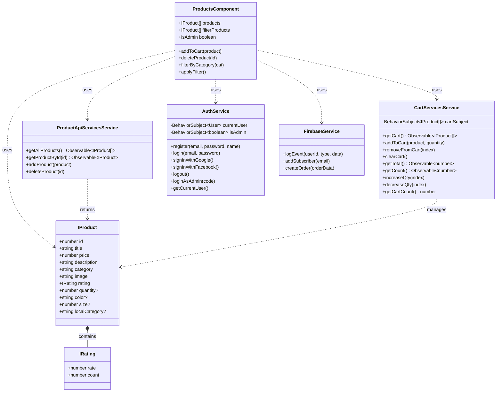
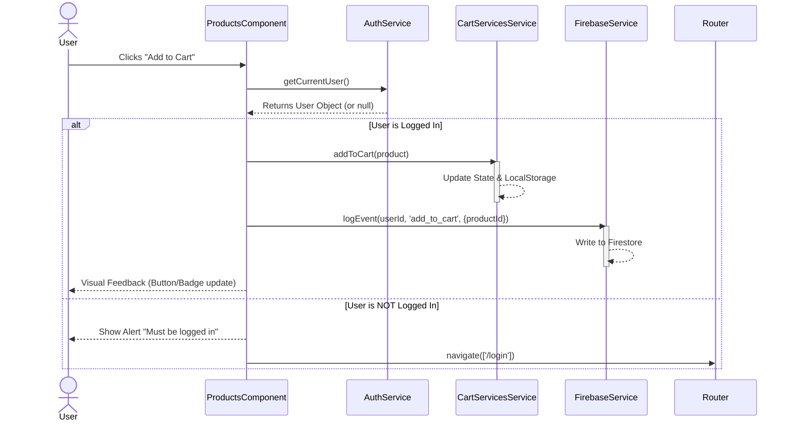

# UML Design for E-commerce-CLOSET

## Class Diagram

This diagram represents the structure of the application, focusing on the core Data Models, Services, and their relationships with the main `ProductsComponent`.

## Sequence Diagram: Add to Cart Flow

This diagram illustrates the interaction between the User, Component, and Services when a user attempts to add a product to the cart.

